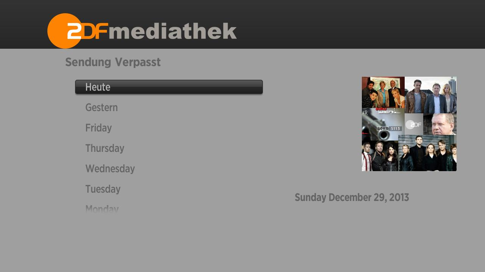
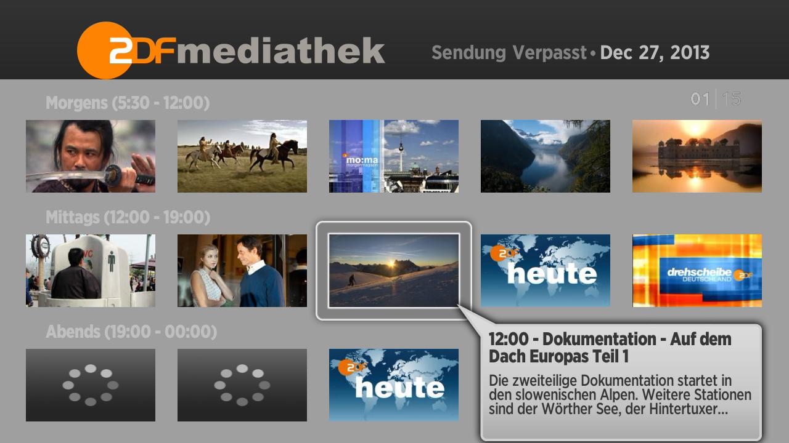
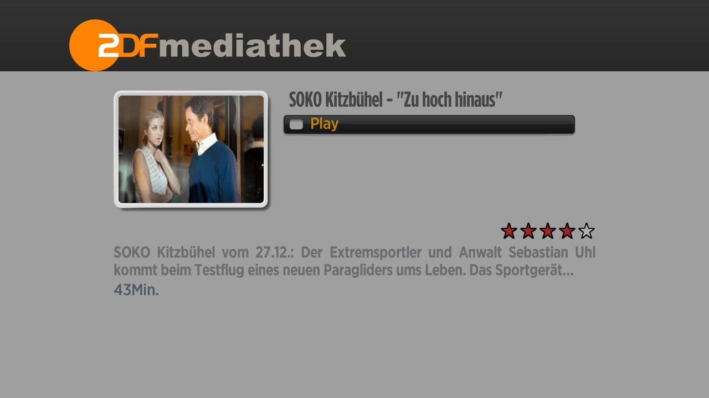

# Roku channel for ZDF Mediathek #

Why?
----
I often find myself watching ZDF Mediathek. Mostly for the crime shows. Before buying a Roku, I
always watched them on my laptop. With a spanking new Roku in hand, it seemed obvious that I
should be watching them on an actual TV and thus the idea to hack up this channel was conceived.

What?
-----
As of now, I only plan on making the 'Sendung Verpasst' section of the Mediathek work. I don't plan
on publishing the channel (mostly I don't want to have to worry about legal reasons) but if you want
it, clone this repo and side load it onto your Roku (only tested on Roku 3). 

Status:
-------
I'm mostly done. It works.

### Notes: ###
- The code is heavily based on Roku's Videoplayer sample which is published under
http://creativecommons.org/licenses/by-nc-nd/3.0/
- ...

### Screenshots ###

